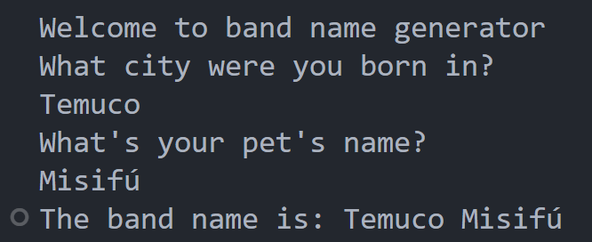

# Proyect Day 1

### Instructions

- Create a greeting for your program.

- Ask the user for the city that they grew up in.

- Ask the user for the name of a pet.

- Combine the name of their city and pet and show them their band name.

- Make sure the input cursor shows on a new line:

### Solution

