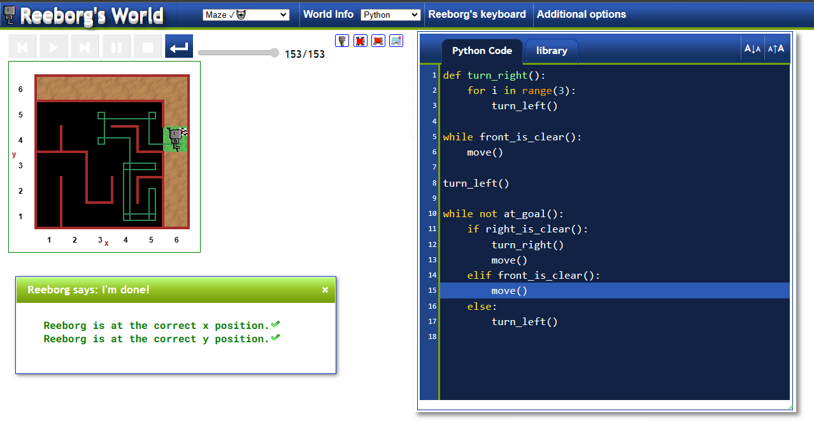

# Reeborg's World

#### Functions
`move()`: Moves Reeborg one square forward in the direction it is currently facing.
`turn_left()`: Turns Reeborg 90 degrees to the left.
`take()`: Picks up an object that is on the square Reeborg is currently on.
`put()`: Puts down an object that Reeborg is carrying on the square it is currently on.
`front_is_clear()`: Returns True if the square in front of Reeborg is clear and False otherwise.
`wall_in_front()`: Returns True if there is a wall in front of Reeborg and False otherwise.
`object_here()`: Returns True if there is an object on the square Reeborg is currently on and False otherwise.
`carries_object()`: Returns True if Reeborg is carrying an object and False otherwise.
`at_goal()`: Returns True if Reeborg is on the goal square and False otherwise.
`done()`: Stops the program and declares that the task has been completed successfully.


# Solution

#### Code
```python 
def turn_right():
    for i in range(3):
        turn_left()
        
while front_is_clear():
    move()

turn_left()

while not at_goal():
    if right_is_clear():
        turn_right()
        move()
    elif front_is_clear():
        move()
    else:
        turn_left()
```

