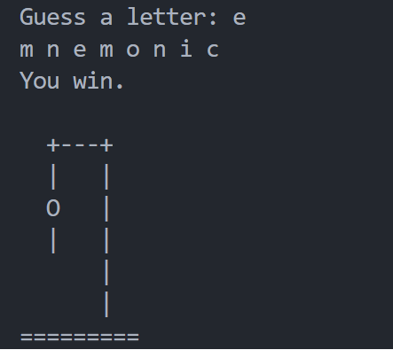
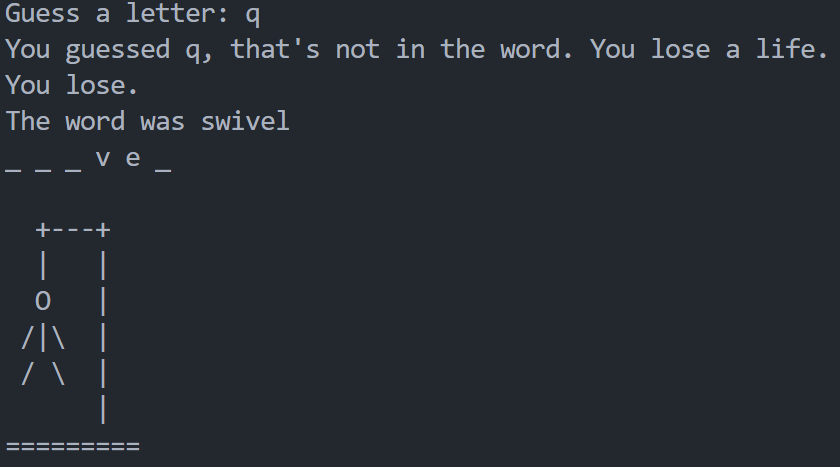

## How to play Hangman
The basic rules of Hangman are pretty simple. One player thinks of a word, phrase, or sentence and the other play has to guess the right word by suggesting different letters. The game starts when player one draws as many blank spaces on a paper as the word or phrase has letters. Always pay attention that you get the spelling right and don’t use slang words. Then player two starts to guess by saying letters more or less randomly.

If player two suggests a letter that occurs, player one writes it in all its correct positions. But if player two says a letter which doesn’t occur in the particular term, player one starts two draw the hangman. Whenever the guessing player says one false letter player two continues his drawing with one line. Player two wins if he gets enough letters to guess the right word. Then the game is over. But if he suggests two many false letters and player one gets to finish his drawing of the hangman then player one wins. The trickiest party while playing the game hangman is choosing the right words. We provided lists of the best hangman words for your game below. If you want to see how to draw the hangman, take a look at the picture below. Each wrong guess is one line!

source: https://psycatgames.com/magazine/party-games/hangman/

## Solution

**Win**

**Lose**

