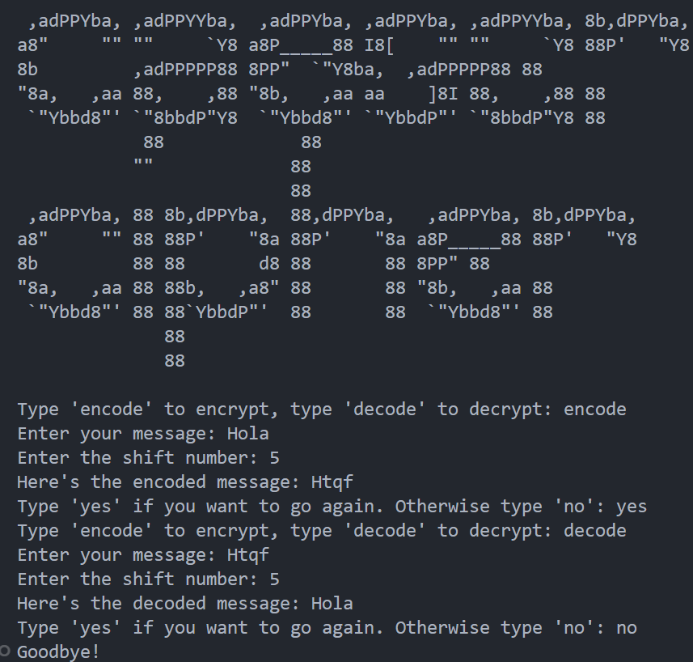

## Solution

This program allows the user to choose between encrypting or decrypting a message. The user then enters a message and the number of positions to move the letters in the alphabet. The program uses the "caesar" function to encrypt or decrypt the message and then displays the result on the screen.

