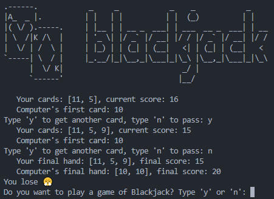
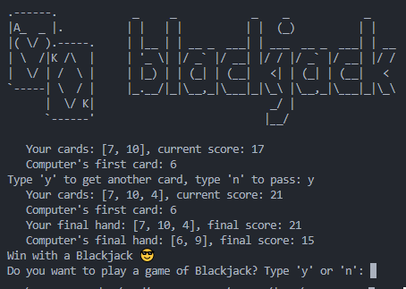

# Blackjack Project

- Difficulty Normal 😎: Use all Hints below to complete the project.
- Difficulty Hard 🤔: Use only Hints 1, 2, 3 to complete the project.
- Difficulty Extra Hard 😭: Only use Hints 1 & 2 to complete the project.
- Difficulty Expert 🤯: Only use Hint 1 to complete the project.

### Our Blackjack House Rules 

- The deck is unlimited in size. 
- There are no jokers. 
- The Jack/Queen/King all count as 10.
- The the Ace can count as 11 or 1.
- Use the following list as the deck of cards:
- cards = [11, 2, 3, 4, 5, 6, 7, 8, 9, 10, 10, 10, 10]
- The cards in the list have equal probability of being drawn.
- Cards are not removed from the deck as they are drawn.
- The computer is the dealer.

### Hints 

#### Hint 1: Go to this website and try out the Blackjack game: https://games.washingtonpost.com/games/blackjack/
- Then try out the completed Blackjack project here: http://blackjack-final.appbrewery.repl.run

#### Hint 2: Read this breakdown of program requirements: http://listmoz.com/view/6h34DJpvJBFVRlZfJvxF

-  Then try to create your own flowchart for the program.

#### Hint 3: Download and read this flow chart I've created: https://drive.google.com/uc?export=download&id=1rDkiHCrhaf9eX7u7yjM1qwSuyEk-rPnt

#### Hint 4: Create a deal_card() function that uses the List below to *return* a random card.
-  11 is the Ace.
-  cards = [11, 2, 3, 4, 5, 6, 7, 8, 9, 10, 10, 10, 10]

#### Hint 5: Deal the user and computer 2 cards each using deal_card() and append().
-  user_cards = []
-  computer_cards = []

#### Hint 6: Create a function called calculate_score() that takes a List of cards as input 
-  and returns the score. 
-  Look up the sum() function to help you do this.

#### Hint 7: Inside calculate_score() check for a blackjack (a hand with only 2 cards: ace + 10) and return 0 instead of the actual score. 0 will represent a blackjack in our game.

#### Hint 8: Inside calculate_score() check for an 11 (ace). If the score is already over 21, remove the 11 and replace it with a 1. You might need to look up append() and remove().

#### Hint 9: Call calculate_score(). If the computer or the user has a blackjack (0) or if the user's score is over 21, then the game ends.

#### Hint 10: If the game has not ended, ask the user if they want to draw another card. If yes, then use the deal_card() function to add another card to the user_cards List. If no, then the game has ended.

#### Hint 11: The score will need to be rechecked with every new card drawn and the checks in Hint 9 need to be repeated until the game ends.

#### Hint 12: Once the user is done, it's time to let the computer play. The computer should keep drawing cards as long as it has a score less than 17.

#### Hint 13: Create a function called compare() and pass in the user_score and computer_score. If the computer and user both have the same score, then it's a draw. If the computer has a blackjack (0), then the user loses. If the user has a blackjack (0), then the user wins. If the user_score is over 21, then the user loses. If the computer_score is over 21, then the computer loses. If none of the above, then the player with the highest score wins.

#### Hint 14: Ask the user if they want to restart the game. If they answer yes, clear the console and start a new game of blackjack and show the logo from art.py.

# Solution

### Lose

### Win

