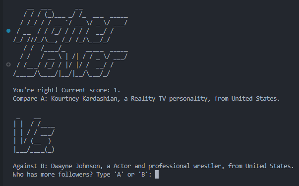

## Instrucctions

Make a comparison of the number of instagram followers, taking into account these points:

- Generate a random account from the game data.

- Format account data into printable format.

- Ask user for a guess.

- Check if user is correct.
- Get follower count.
- If Statement

- Feedback.

- Score Keeping.

- Make game repeatable.

- Make B become the next A.

- Add art.

- Clear screen between rounds.

## Solution

